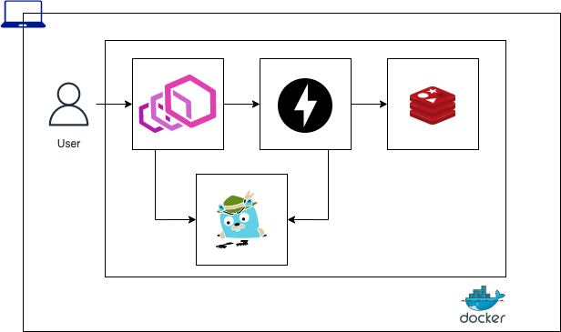

# tracing envoy fastapi redis sample


## Architecture


## Prerequisites

### Poetry Preparation
```bash
# download poetry
curl -sSL https://raw.githubusercontent.com/python-poetry/poetry/master/get-poetry.py | python
# make poetry enable
source $HOME/.poetry/env
# make virtualenvs enable
poetry config virtualenvs.in-project true
```

## How to run app
```bash
make up
open http://localhost:16686/
make health
make insert
make bulk-insert
make select
```
